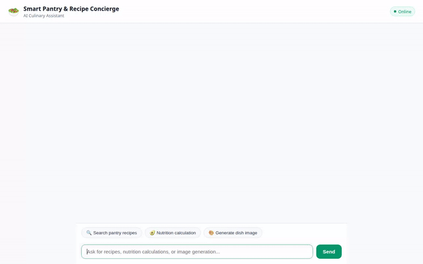

# Smart Pantry & Recipe Concierge 🥑 Stewing AI Innovation with Gemini & Vertex AI



A state-of-the-art AI-powered culinary assistant built with Google's **Agent Development Kit (ADK)**, **Gemini 2.5 Flash**, **Imagen 3**, **Veo**, **Vertex AI Memory Bank**, **Firestore**, **Google Maps**, and **Cloud Storage**.

---

## 🌟 Capabilities & Features

### 🔍 Smart Pantry & Recipe Search
- **Firestore Pantry Database**: Search through local recipe collections by ingredient, cuisine type, or dietary tags (e.g. `keto`, `vegan`, `gluten-free`).
- **Custom Recipe Creation**: Add personal recipes directly into Firestore with prep times, instructions, and nutrition profiles.

### 🌐 Global Web Grounding & Maps Discovery
- **Google Search Grounding**: Discover global culinary recipes and cooking techniques beyond the local pantry.
- **Google Maps Places API**: Geocode addresses and locate nearby grocery stores, supermarkets, and specialty food markets.

### 🎨 Generative Media (Photos & Videos)
- **Imagen 3 Integration**: Generate vibrant, studio-quality food photography (`imagen-3.0-generate-002`) rendered directly inside the chat UI and archived to Cloud Storage.
- **Veo / Gemini Omni Video Generation**: Generate short culinary videos (`gemini-omni-flash-preview`), saved as session artifacts and uploaded to public Cloud Storage buckets.

### 🧠 Persistent Long-Term Memory
- **Vertex AI Memory Bank**: Retains user dietary preferences, allergies, and kitchen history across sessions using `PreloadMemoryTool` and post-turn memory callbacks.

### 🃏 Rich A2UI Interface
- Native A2UI card renderer displaying structured recipe cards, nutritional breakdowns, and inline generated food photos in a sleek dark-themed UI.

---

## 🛠️ Architecture & Google Cloud Services

- **Core Framework**: Google Agent Development Kit (ADK)
- **Primary LLM**: `gemini-2.5-flash`
- **Database**: Google Cloud Firestore (`projects/qwiklabs-gcp-02-f418aae87c3d/databases/(default)`)
- **Storage**: Google Cloud Storage (`smart-pantry-recipes-qwiklabs-gcp-02-f418aae87c3d`)
- **Memory**: Vertex AI Memory Bank (`us-east1`)
- **Location Services**: Google Maps Geocoding & Places APIs
- **Agent Protocol**: A2A (Agent-to-Agent) Protocol via Agent Runtime

---

## 🚀 Running Locally

### Prerequisites
- Python 3.10+
- Google Cloud SDK (`gcloud`) with Application Default Credentials (`gcloud auth application-default login`)

### Setup & Launch

1. **Install Dependencies**:
   ```bash
   pip install -r requirements.txt
   ```

2. **Set Environment Variables**:
   ```bash
   export AGENT_ENGINE_RESOURCE_NAME="projects/<PROJECT_ID>/locations/us-east1/reasoningEngines/<RESOURCE_ID>"
   export AGENT_DIRECTORY="app"
   ```

3. **Start local proxy & chat UI**:
   ```bash
   cd frontend
   pip install -r requirements.txt
   python main.py
   ```

4. **Access Chat Interface**:
   Open `http://localhost:8080` in your web browser.

---

## 📦 Deployment

Deploy the agent to Agent Platform using the `agents-cli`:

```bash
agents-cli deploy --no-confirm-project
```

Deploy the frontend proxy service to Cloud Run:

```bash
gcloud run deploy smart-pantry-frontend \
  --source=frontend \
  --region=us-east1 \
  --allow-unauthenticated \
  --set-env-vars AGENT_ENGINE_RESOURCE_NAME="<AGENT_ENGINE_RESOURCE_NAME>",AGENT_DIRECTORY="app"
```
